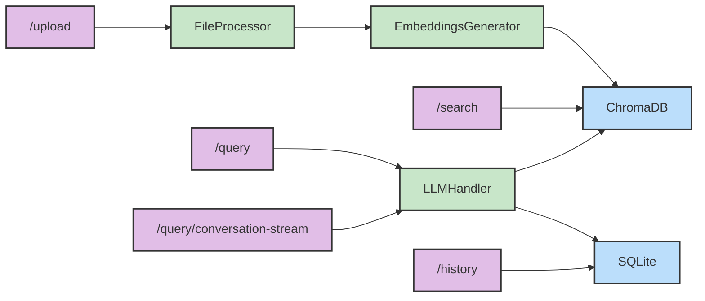

# RAG Pipeline

A production-ready Retrieval Augmented Generation (RAG) pipeline that processes various document types, generates embeddings, and provides a conversation interface using local LLMs.

## Features

### Document Processing
- Support for multiple file formats:
  - Raw Text files (TXT, MD)
  - Documents (PDF, DOC, DOCX)
  - Markup files (XML)
  - Comma separated value files (CSV)
  - Images (with OCR)
  - Videos (frame extraction and OCR)
- Automatic chunking and preprocessing
- Image cleaning and optimization
- Video frame analysis with relevance filtering

### Embedding Generation
- Configurable embedding models
- Efficient text chunking
- Batched processing for large documents
- Model dimension validation

### Vector Storage
- Persistent storage using ChromaDB
- Automatic batch processing for large datasets
- Metadata tracking
- Dimension compatibility checks

### Local Inference
- Support for GGUF models
- Metal acceleration for Apple Silicon
- Configurable inference parameters
- Conversation history tracking

### Simplified Diagram



## Installation

1. Create a virtual environment:
```bash
python -m venv .venv
source .venv/bin/activate  # Unix/MacOS
# or
.\venv\Scripts\activate    # Windows
```

2. Install dependencies:
```bash
# For production
pip install -r requirements.txt

# For development
pip install -r requirements-dev.txt
```

3. Set up environment variables in `.env`:
```env
# API Settings
API_HOST=0.0.0.0
API_PORT=8000

# Vector Store
VECTOR_STORAGE_DIR=./storage

# Embedding Model
EMBEDDING_MODEL=multi-qa-distilbert-cos-v1
EMBEDDING_CHUNK_SIZE=500

# LLM Settings
LLM_MODEL_TYPE=llama
LLM_MAX_TOKENS=512
LLM_TEMPERATURE=0.7
LLM_TOP_P=0.95
```

## Usage

#### Starting the Server
```bash
python src/main.py
```

### 1. Adding and Processing Files

```bash
# Upload a document
curl -X POST -F "file=@/path/to/document.pdf" http://localhost:8000/upload
```

#### 2. Search storage for similar documents:

```bash 
curl -X GET http://localhost:8000/search?query=Test&limit=20
```

#### 3. Question example:

```bash 
# Ask a question about the file
curl -X POST -H "Content-Type: application/json"
                -d '{"query": "What are the main points in the document?"}'
  http://localhost:8000/query/stream
```

#### 4. Conversation example:

```bash 
# Start new conversation
curl -X POST -H "Content-Type: application/json"
                -d '{"query": "What are the main points in the document?"}'
  http://localhost:8000/query/conversation-stream

# Continue conversation with ID
curl -X POST -H "Content-Type: application/json"
                -d '{"query": "Can you elaborate on the first point?", "conversation_id": 1}'
  http://localhost:8000/query/conversation-stream
```

#### 4. History:

```bash 
# Retrieve query history
curl -X GET http://localhost:8000/history?limit=5
```

## Configuration

### Vector Store
- `VECTOR_STORAGE_DIR`: Location for persistent storage
- Maximum batch size: 5000 documents per batch

### Embedding Model
- Default model: `multi-qa-distilbert-cos-v1`
- Configurable chunk size for text splitting
- Automatic dimension validation

### LLM Configuration
- Model parameters:
  - `temperature`: 0.0 - 1.0 (default: 0.7)
  - `top_p`: 0.0 - 1.0 (default: 0.95)
  - `max_tokens`: 1 - model context length (default: 512)

### Image Processing
- Minimum DPI: 300
- Minimum dimensions: 800x600
- Automatic metadata cleaning

### Video Processing
- Frame extraction with similarity detection
- OCR confidence threshold: 60
- Automatic dark/blur frame filtering

## Development

### Code Formatting
```bash
# Format code
ruff format .
```

### Running Tests (@todo)
```bash
pytest
# With coverage
pytest --cov=src tests/
```

## Limitations and Considerations

- Maximum batch size of 5000 documents for vector storage
- Memory usage depends on document size and embedding dimensions
- Video processing can be resource-intensive
- Local LLM performance depends on hardware capabilities

## Contributing

1. Fork the repository
2. Create a feature branch
3. Commit your changes
4. Push to the branch
5. Create a Pull Request

## License

This project is licensed under the MIT License - see the LICENSE file for details.
